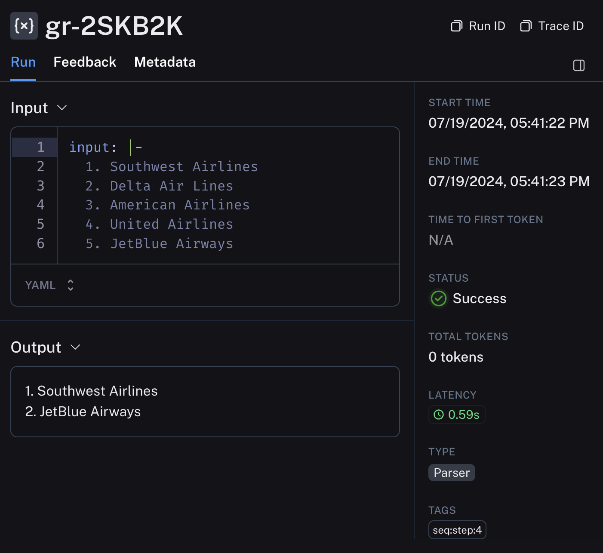

# LangChain

## Overview

This is a comprehensive guide on integrating Guardrails with [LangChain](https://github.com/langchain-ai/langchain), a framework for developing applications powered by large language models. By combining the validation capabilities of Guardrails with the flexible architecture of LangChain, you can create reliable and robust AI applications.

### Key Features

- **Easy Integration**: Guardrails can be seamlessly added to LangChain's LCEL syntax, allowing for quick implementation of validation checks.
- **Flexible Validation**: Guardrails provides various validators that can be used to enforce structural, type, and quality constraints on LLM outputs.
- **Corrective Actions**: When validation fails, Guardrails can take corrective measures, such as retrying LLM prompts or fixing outputs.
- **Compatibility**: Works with different LLMs and can be used in various LangChain components like chains, agents, and retrieval strategies.

## Prerequisites

1. Ensure you have the following langchain packages installed:

    ```bash
    pip install langchain langchain_openai
    ```

2. As a prerequisite we install the necessary validators from the Guardrails Hub:

    ```bash
    guardrails hub install hub://guardrails/competitor_check --quiet
    guardrails hub install hub://guardrails/toxic_language --quiet
    ```

   - `CompetitorCheck`: Identifies and optionally removes mentions of specified competitor names.
   - `ToxicLanguage`: Detects and optionally removes toxic or inappropriate language from the output.

## Basic Integration

Here's a basic example of how to integrate Guardrails with a LangChain LCEL chain:

1. Import the required imports and do the OpenAI Model Initialization

    ```python
    from langchain_openai import ChatOpenAI
    from langchain_core.output_parsers import StrOutputParser
    from langchain_core.prompts import ChatPromptTemplate

    model = ChatOpenAI(model="gpt-4")
    ```

2. Create a Guard object with two validators: CompetitorCheck and ToxicLanguage.

    ```python
    from guardrails import Guard
    from guardrails.hub import CompetitorCheck, ToxicLanguage

    competitors_list = ["delta", "american airlines", "united"]
    guard = Guard().use_many(
        CompetitorCheck(competitors=competitors_list, on_fail="fix"),
        ToxicLanguage(on_fail="filter"),
    )
    ```

3. Define the LCEL chain components and pipe the prompt, model, output parser, and the Guard together.
The `guard.to_runnable()` method converts the Guardrails guard into a LangChain-compatible runnable object.

    ```python
    prompt = ChatPromptTemplate.from_template("Answer this question {question}")
    output_parser = StrOutputParser()

    chain = prompt | model | guard.to_runnable() | output_parser
    ```

4. Invoke the chain

    ```python
    result = chain.invoke({"question": "What are the top five airlines for domestic travel in the US?"})
    print(result)
    ```

    Example output:
    ```
    1. Southwest Airlines
    3. JetBlue Airways
    ```

In this example, the chain sends the question to the model and then applies Guardrails validators to the response. The CompetitorCheck validator specifically removes mentions of the specified competitors (Delta, American Airlines, United), resulting in a filtered list of non-competitor airlines.

## Advanced Usage

### LangSmith Integration

LangSmith is a powerful tool for tracing, monitoring, and debugging your AI applications. Here's how to use it with your Guardrails-enhanced LangChain:

1. Set up Langsmith:

   ```bash
   pip install langsmith
   export LANGCHAIN_TRACING_V2=true
   export LANGCHAIN_ENDPOINT="https://api.smith.langchain.com"
   export LANGCHAIN_API_KEY="your-api-key"
   ```

2. View traces in the Langsmith UI to analyze:
   - LLM inputs and outputs
   - Guardrails validator results
   - Performance metrics
   - Error logs




By integrating LangSmith, you can gain deeper insights into how your Guardrails validators are affecting the LLM outputs and overall chain performance.